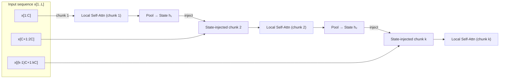

# BLADE — Block-Local Attention with Per-Block State

**Idea.** Treat the sequence as dense local clusters (chunks) with a compact state passed forward so information carries across chunks without full K/V memory.

- Exact causal attention **within each chunk**
- A small **per-chunk state** `h_i` summarizes the chunk and conditions the next
- Optional **global tokens** provide lightweight global connectivity
- Pre-LN + FFN for stable stacking

## Diagram



> Each chunk runs causal attention (optionally with globals prepended). The post-attn features are pooled to a state $h_i$ that conditions the next chunk via a small projection.

## Math (minimal)

* Chunk size $C$, heads $H$, model dim $d$
* Per chunk $i$, tokens $x_i \in \mathbb{R}^{B\times C\times d}$
* Local attention within chunk (standard causal self-attn)
* State update:
    $h_i = \text{MLP}\left(\sum{y_i}\mathbin{/}|y_i|\right) \in \mathbb{R}^{B\times d_s}$
* State injection into next chunk:
    $x_{i+1} = \text{LN}(x_{i+1}) + W_\text{inj}h_i$

## Pseudocode (forward)

```python
state = zeros(B, d_s)
outs = []
for chunk in chunks(x, C):
    h = LN_attn(chunk) + W_inj(state).unsqueeze(1)
    if m_global > 0:
        h = cat([global_tokens.expand(B, -1, -1), h], dim=1)
    y = local_causal_attn(h)[:, m_global:, :]
    y = chunk + Drop(y)                 # residual 1
    y = y + Drop(FFN(LN_ffn(y)))        # residual 2
    outs.append(y)
    state = MLP(mean(y, dim=1))
return cat(outs, dim=1), state
```

## Complexity

* Attention per chunk: $O(C^2)$; for $k \approx L/C$ chunks : $O(kC^2) = O(LC)$
* State passing: $O(kd_sd)$ (negligible vs. attention)

## Configuration Tips

* `chunk_size` $C$: 512–2048
* `state_dim` $d_s$: 128–512
* `m_global`: 0–4 (start with 0)
* Use shifted chunk boundaries every few layers for extra mixing (future option)
